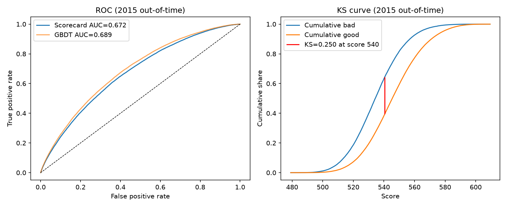
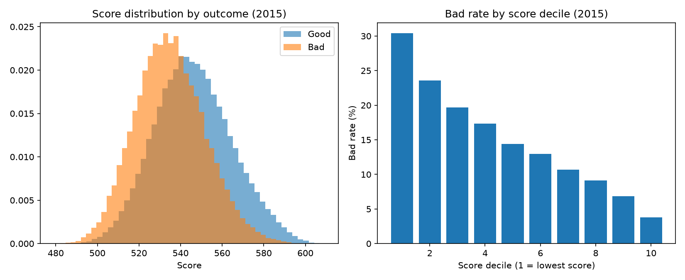
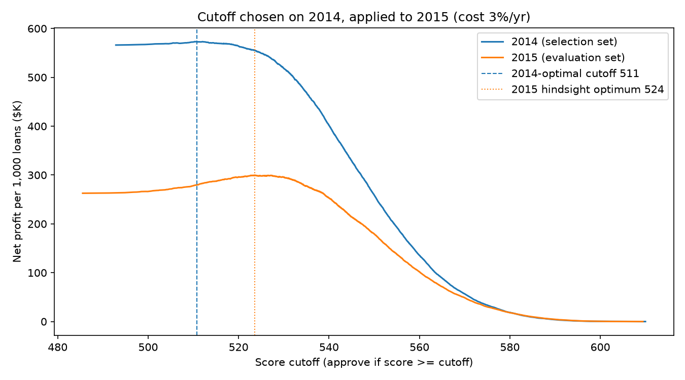
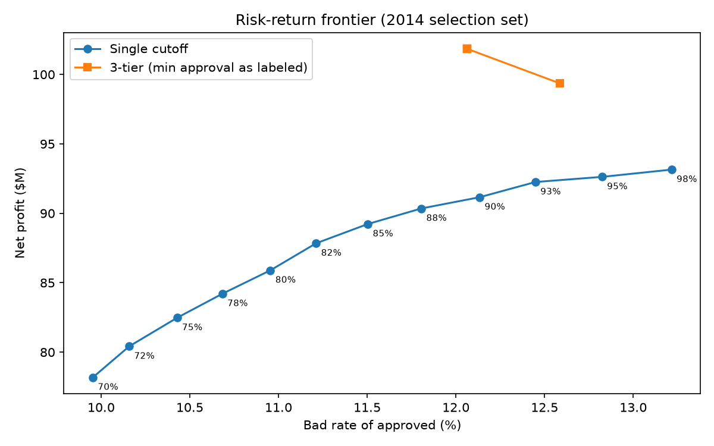
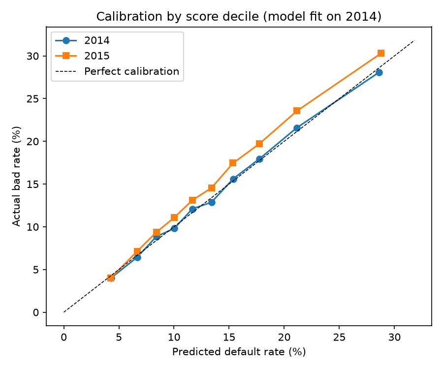

# 信贷风控策略项目：评分卡建模 · 收益驱动的分层策略 · 大模型辅助风控运营

基于 Lending Club 2014–2015 年 44.6 万笔 36 期贷款，完成从风险画像、评分卡建模，到以净收益为目标的授信策略优化，再到大模型辅助归因、报告与知识检索的完整链路。

## 核心结果

| 模块 | 结果 |
|---|---|
| 评分卡（2015 跨时间测试） | AUC 0.6725，KS 0.2503；分数 PSI 0.0019；分数十等分坏账率从 30.4% 单调降至 3.8% |
| 单阈值（2014 选阈值，2015 样本外回测） | 净收益 $79.2M，比全部通过多 $4.8M；比 2015 事后最优少 $5.6M（阈值漂移代价） |
| 三层分层策略（同上，样本外） | 净收益 $98.0M，比单阈值高 23.8%；加验只要拦下 11.2% 的坏客户即可盈亏平衡；不同加验假设下提升在 -0.2% 到 +28.2% 之间 |
| 校准与定价诊断 | 2015 年预测违约率 13.63%、实际 14.89%，10 档中 9 档被低估；最低档明显亏损、第 2 档基本打平，最低档年化利率约需上调 1.9 个百分点 |
| Swap Set | 通过率同为 85% 时，评分卡相对只看 FICO 的规则，坏账率从 14.21% 降到 12.49% |
| 大模型辅助归因 | 大模型提出 6 条假设，数据校验后 3 条规律成立、2 条部分成立、1 条不成立；坏账上升主要来自同等资质客户的表现恶化，而非客群结构变化 |

## 数据与样本

- 数据：Kaggle "All Lending Club loan data"（`accepted_2007_to_2018Q4.csv`），原始数据未上传，下载后放入 `data/archive.zip`
- 样本：2014–2015 年放款、期限 36 个月的贷款。数据截至 2018 年底，这批贷款基本都已到期，每笔都能看到最终结局
- 标签：坏 = 核销（Charged Off）/ 违约（Default）；好 = 已结清（Fully Paid）；结局未定的 147 笔剔除
- 切分：2014 年训练，2015 年测试（跨时间验证）
- 整体坏账率 14.46%（2014：13.73%，2015：14.89%）

## 方法

### 1. 风险画像（SQL）
`sql/01_risk_profile.sql`：按评级、FICO、负债收入比（窗口函数 NTILE 十等分）、借款用途、住房、征信查询次数、贷款金额等维度统计坏账率。

主要发现：FICO 从 <680 到 750+，坏账率从 18.65% 降到 5.25%；近 6 个月征信查询 3 次以上的坏账率为 21.32%，是 0 次的 1.7 倍；2 万美元以上大额贷款坏账率反而最低（12.93%），反映平台只把大额度批给资质好的人，是拒绝推断问题的实证。

### 2. 评分卡（Python）
- 特征白名单：只用申请时点可得的 25 个字段；贷后还款、催收回款、贷后征信等字段排除，防止数据穿越；LC 自己的评级与利率不入模（它们是 LC 风控模型的输出）
- WOE 分箱：训练集 10 分位切箱，合并坏账率不单调的相邻箱；缺失值单独成箱
- 变量筛选：IV ≥ 0.02，两两相关 > 0.7 时保留 IV 高者，最终 13 个变量入模
- 逻辑回归：检查系数符号与显著性；分数刻度为好坏比 50:1 对应 600 分，PDO = 20
- 对比：梯度提升树测试集 AUC 0.6886、KS 0.2740，仅比评分卡高 0.016；授信决策需要可解释性，因此采用评分卡

### 3. 策略层
- 收益口径：净收益 = 实际收回金额 − 本金 − 资金与运营成本（年化 3%，平均占用 1.5 年）；拒绝的收益为 0
- 样本外设计：所有阈值只在 2014 年数据上确定，再原样用到 2015 年计算收益；2015 年自身的最优解只作为"事后上限"
- 单阈值：2014 年收益最优的分数线为 510.8（通过率 97.4%）。边际分析与之一致：通过率每多放开 2.5 个百分点，净收益增量一直为正，直到 97.5% 以后才转负。用到 2015 年，净收益 $79.2M，比全部通过多 $4.8M，但比 2015 事后最优（$84.8M）少 $5.6M
- 一个反直觉的样本外结果："坏账率 ≤ 10%"的保守分数线在 2015 年反而多赚 $1.0M。原因是 2015 年客群表现变差，在 2014 年上优化出的宽松分数线放进了更多坏客户。结论：分布漂移时，收益最优阈值需要更频繁地重估
- 成本敏感性：年化成本从 2% 升到 5%，2014 年选出的最优通过率从 97.6% 降到 83.3%，5% 时 2015 年净收益转负
- 三层策略：2014 年上网格搜索两个阈值（< 502 拒绝，502–529 加验，≥ 529 直接通过）。收益是分数阈值的阶梯函数，没有可用的梯度，而约 200 × 200（实际 201 × 201）的组合全部枚举能保证全局最优。2015 年样本外净收益 $98.0M，比单阈值高 23.8%
- 加验假设（拦截 40% 坏客户、流失 10% 好客户、单笔 $30）：盈亏平衡拦截率为 11.2%；每组假设都在 2014 年重新求阈值再到 2015 年评估，提升在 -0.2% 到 +28.2% 之间，需要 A/B 实验校准
- 校准：按分数十等分，2015 年预测违约率 13.63%、实际 14.89%，10 档中 9 档实际高于预测。模型排序能力稳定（PSI 0.0019），但违约概率整体被低估，这正是阈值漂移的来源
- 定价诊断：2015 年最低档分数净收益率 −2.8%，明显亏损，年化利率约需上调 1.9 个百分点才能打平；第 2 档基本打平（−0.01%）；其余各档均盈利
- 监控：2015 年各月分数与关键特征 PSI 均 < 0.05，没有触发预警；但校准和阈值漂移说明，PSI 稳定不代表不需要重新校准，监控必须同时跟踪各分数段的实际坏账率

### 4. 大模型辅助风控运营
- **归因**：大模型针对"2015 年坏账率为什么上升"提出 6 条假设，代码把坏账率变化拆成结构效应与组内效应逐条校验，并做人工复核（`output/attribution_human_review.md`）。结论：客群结构并未变差，坏账上升主要来自同等资质客户的表现恶化；A–F 各评级利率均下调而 B–F 坏账率上升，与"定价不足"的解释一致，但未证明因果
- **自动化月报**：所有数字由代码计算，大模型只写解读；生成后自动核对解读中的每个数字。Prompt v1 出现 1 个模型自行推算的数字，v2 加入"只能引用给定数字"的规则后为 0（`output/prompt_iteration.md`）
- **RAG 知识库**：6 份内部文档切成 26 个片段，TF-IDF 检索加相似度拒答阈值；8 个测试问题全部检索正确，库外问题正确拒答
- **边界**：大模型不参与授信决策。决策需要可解释、可复现、可审计，由评分卡与策略规则承担；大模型只用于归因、报告与知识检索等提效场景
- 调用方式：未使用 API，prompt 与回答通过 Claude 网页版人工传递；`scripts/llm_client.py` 同时支持 API 调用

## 图表







## 局限性

1. 只观察到 LC 已批准的贷款，被拒申请人的表现未知（拒绝推断问题），"通过率"是在已放款客群中的通过率
2. 标签为最终结局口径；线上监控需改用首期逾期率等早期指标
3. 资金与运营成本、加验效果均为假设参数，结论对它们敏感，已做敏感性分析
4. 净收益未折现，也未考虑提前还款对利息收入的时间影响
5. 归因分析中的分组规律只能说明相关，不能证明因果
6. 未做 vintage 账龄分析：数据只有最终状态，没有逐月还款记录，无法可靠还原每个放款月的逐月累计坏账曲线
7. 阈值在 2014 年的评分上选择，而评分卡也在 2014 年训练，选择集上的分数略偏乐观；更严格的做法是再留出一个验证期

## 目录与复现

```
scripts/01_slice_data.py        切出 2014–2015 年 36 期贷款
scripts/02_build_db.py          写入 SQLite
sql/01_risk_profile.sql         风险画像
scripts/03_features.py          标签、特征白名单、跨时间切分
scripts/04_woe_iv.py            WOE 分箱与 IV 筛选
scripts/05_scorecard.py         评分卡、AUC/KS/PSI、树模型对比
scripts/06_strategy.py          阈值优化、三层策略、Swap Set、月度监控
scripts/07_llm_attribution.py   大模型归因与数据校验
scripts/08_auto_report.py       自动化月报与数字核对
scripts/09_rag_kb.py            RAG 知识库问答
kb/                             知识库文档
output/                         全部结果表与图
```

依次运行 `python scripts/01_slice_data.py` 到 `09_rag_kb.py`；风险画像用 `sqlite3 data/risk.db < sql/01_risk_profile.sql`。依赖：pandas、numpy、scikit-learn、scipy、matplotlib。
